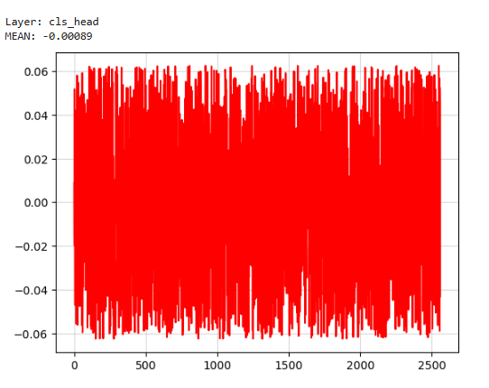
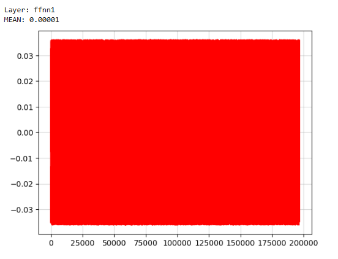
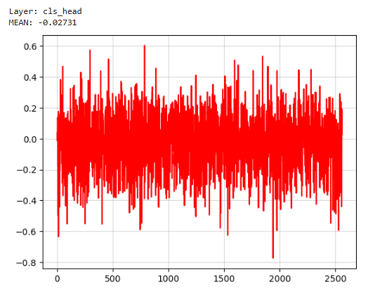
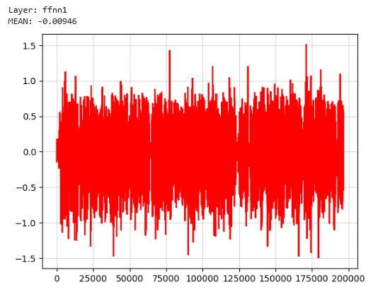
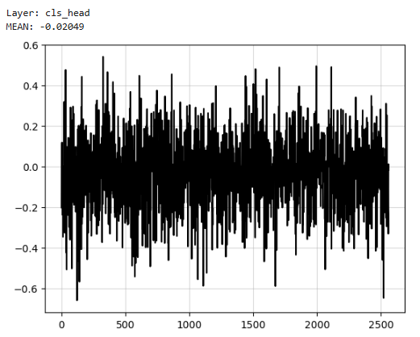
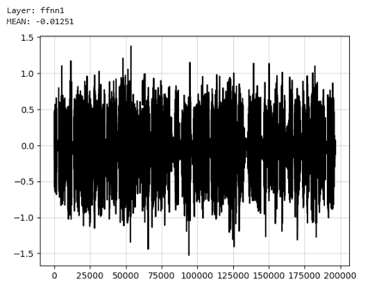
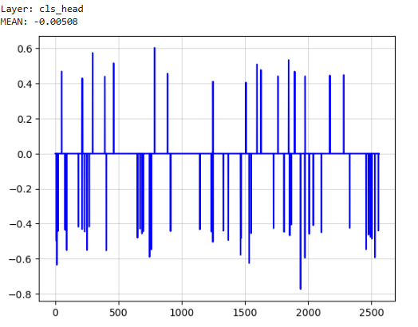
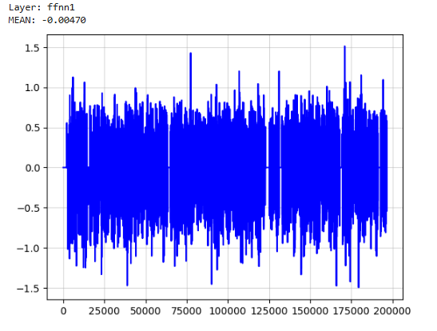

# Model Compression — Threshold-Based Weight Pruning

A visual exploration of how threshold pruning transforms neural network weight distributions across training stages.

---

## What is Threshold-Based Pruning?

Pruning removes small-magnitude weights from trained neural networks to create sparse models that use less memory and run faster while maintaining accuracy. The core idea: many weights contribute little to predictions, so removing them barely affects performance.

---

## Repository Structure

```
prunning/static/
├── initialization-cls-head.png
├── initialization-ffnn.png
├── before-pruning-distribution-cls-head.png
├── before-pruning-distribution-ffnn.png
├── threshold-inside-the-training-loop-cls.png
├── threshold-inside-the-training-loop-ffnn.png
├── at-prune-0.4-cls-head.png
└── at-prune-0.4-ffnn.png
```

Visualizations track two components:
- **CLS Head**: Classification output layer
- **FFNN**: Feed-forward hidden layers

---

## The Four Stages

### Stage 1: Initialization



Weights start as a narrow bell curve around zero. This symmetric distribution comes from standard initialization schemes designed to prevent gradient problems during early training.

---

### Stage 2: After Training (Before Pruning)



Training spreads weights across a broader range. Important connections grow large (positive or negative), while unimportant ones stay near zero. This natural separation happens because gradient descent amplifies useful connections and ignores redundant ones.

---

### Stage 3: Pruning During Training



A massive spike appears at zero as weights below the threshold get repeatedly removed during training. The network adapts by strengthening remaining connections to compensate. This creates a clear divide: weights are either zero (pruned) or significantly non-zero (important).

---

### Stage 4: Post-Training Pruning (τ = 0.4)



One-shot removal of all weights with magnitude below 0.4 after training completes. Unlike during-training pruning, the network had no chance to adapt, often requiring fine-tuning to recover performance.

---

## Key Insights

**Why the zero spike is so tall:** When pruning 60-70% of millions of parameters, they all stack at exactly zero in the histogram.

**Layer differences:** Classification heads often retain stronger weights than hidden layers because they directly determine output predictions.

**Two pruning strategies:**
- **During training**: Network adapts to sparsity as it learns, usually better performance
- **Post-training**: Faster to apply but may need fine-tuning to recover accuracy

**The sparsity-accuracy tradeoff:** Higher thresholds create sparser models but risk losing important connections. Typical pruning removes 50-90% of weights with minimal accuracy loss.

---

## Typical Outcomes

Dense model: 100M parameters, 92% accuracy
Pruned model (70% sparse): 30M parameters, 91-92% accuracy

The goal is maximizing compression while minimizing accuracy drop.

---

## Resources

**Core papers:**
- "Learning both Weights and Connections" (Han et al., 2015) - Original magnitude pruning
- "The Lottery Ticket Hypothesis" (Frankle & Carbin, 2019) - Why sparse networks work
- "Rethinking Network Pruning" (Liu et al., 2019) - Challenges conventional wisdom

---

## Repository

All images: https://github.com/ajheshbasnet/model-compression/tree/main/prunning/static

---

## License

MIT License
